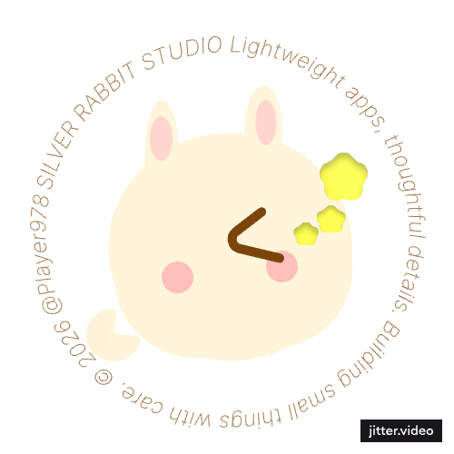

  

<h3 align="center">Hello, I'm Elenor Z.</h3>
<h4 align="center">Developer • Designer • Indie Builder </h4>

Creating thoughtful experiences through code. 
用代码创造美好。

<h3 align="center">   Currently Exploring</h3>

<ul align="center">Appian workflow systems • DevOps • TypeScript • Thoughtful UX • Blender </ul>

<h3 align="center">   Featured Projects</h3>

 Workflow automation prototype built with Appian: <a href="https://github.com/zhaqy079/appianDemo">Appian Workflow</a>  

 

 Real-time volunteer management platform built with React, .NET, and Supabase: <a href="https://github.com/zhaqy079/ChatSeat2.0">ChatSeat</a>

 Interactive dashboard exploring mobile phone usage and driving risk patterns with SQL and D3.js: <a href="https://github.com/zhaqy079/MPDC-Selector">MPDC Dashboard</a>

 Ongoing DevOps and infrastructure experiments with Docker, Linux, and CI/CD workflows: <a href="https://github.com/zhaqy079/DevOps-Lab">DevOps Lab</a>

<h3 align="center">  Tech Stack</h3>

Programming & Scripting: 
<a href="https://developer.mozilla.org/en-US/docs/Web/javascript" target="_blank" rel="noreferrer">  
<a href="https://developer.mozilla.org/en-US/docs/Web/python" target="_blank" rel="noreferrer">  
<a href="https://developer.mozilla.org/en-US/docs/Web/csharp" target="_blank" rel="noreferrer">  
<a href="https://developer.mozilla.org/en-US/docs/Web/react" target="_blank" rel="noreferrer"> 

Systems & Infrastructure:
    <a href="https://developer.mozilla.org/en-US/docs/Web/linux" target="_blank" rel="noreferrer">  
    <a href="https://developer.mozilla.org/en-US/docs/Web/docker" target="_blank" rel="noreferrer"> 
    <a href="https://developer.mozilla.org/en-US/docs/Web/jenkins" target="_blank" rel="noreferrer">  

    

 Data & Visualisation: 
    <a href="https://developer.mozilla.org/en-US/docs/Web/mysql" target="_blank" rel="noreferrer"> 
    <a href="https://developer.mozilla.org/en-US/docs/Web/d3js" target="_blank" rel="noreferrer"> 

 Tools & Collaboration: 
    <a href="https://developer.mozilla.org/en-US/docs/Web/git" target="_blank" rel="noreferrer">   
    <a href="https://developer.mozilla.org/en-US/docs/Web/figma" target="_blank" rel="noreferrer"> 

